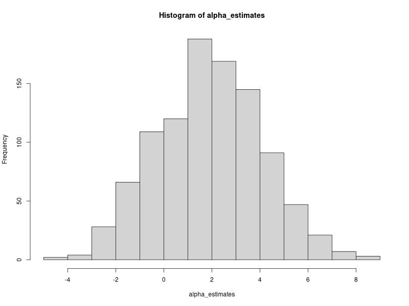
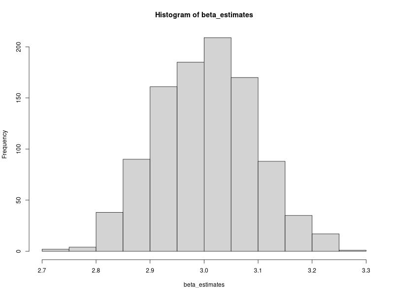

---
tags:
  - problem
  - linear_statistical_models
  - college
---
# Problem
We study the *consistency* property of the least squares estimators in simple linear regression setup.

## Part a
Fix the sample size $n = 25$. Also fix two constants $\alpha$ and $\beta$. Generate $x_{1},\dots,x_{n} \overset{\text{iid}}{\sim} \mathcal{N}(25,4)$. Treat these as fixed covariates.

## Part b
Construct $y_{1},\dots,y_{n}$ using $y_{i}=\alpha+\beta x_{i}+\epsilon_{i}$ for $i = 1,\dots,n$, where $\epsilon_{i} \overset{\text{iid}}{\sim} \mathcal{N}(0,1)$. Fit a simple linear regression model to find the estimates of $\alpha$ and $\beta$.

## Part c
Repeat part (b) 1000 times to get estimates $\hat{\alpha}_{1},\dots,\hat{\alpha}_{1000}$ and $\hat{\beta}_{1},\dots, \hat{\beta}_{1000}$. Make histograms of $\hat{\alpha}_{i}$'s and $\hat{\beta}_{i}$'s. What do you see?

## Part d
Repeat part (a)-(c) with $n=50,100,200,500,1000$. What do you observe?
# Solution

## Part a
```r
#| label: f5ca38f7

generate_covariates <- function(n){
	alpha <- 2
	beta <- 3
	x <- rnorm(n, mean = 25, sd = 2)
	x
}
```
## Part b

```r
#| label: 59e19706
generate_data <- function(n){
	generate_covariates(n)
	epsilon <- rnorm(n, mean = 0, sd = 1)
	y <- alpha + beta * x + epsilon
	model <- lm(y ~ x)
	coef(model)
}
```
## Part c
```r
#| label: 7a61b537
alpha_estimates_50 <- replicate(n = 1000, expr = generate_data(50)[1]) |> as.numeric()
beta_estimates_50 <- replicate(n = 1000, expr = generate_data(50)[2]) |> as.numeric()
alpha_estimates_100 <- replicate(n = 1000, expr = generate_data(100)[1]) |> as.numeric()

hist(alpha_estimates)
hist(beta_estimates)
```
> [!OUTPUT]+ {#output-7a61b537}
> 
> 
> 

