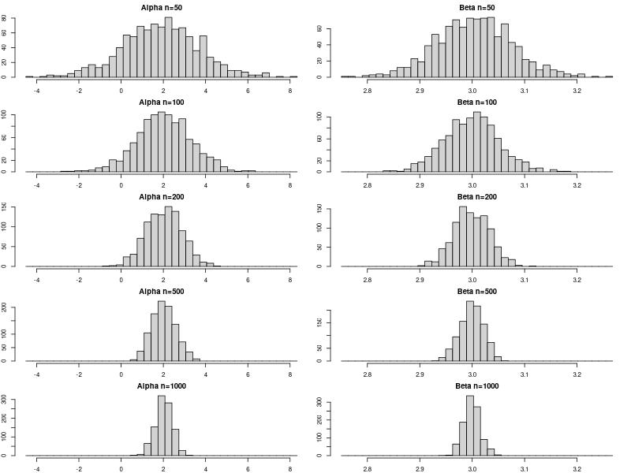

---
tags:
  - problem
  - linear_statistical_models
  - college
---
# Problem
We study the *consistency* property of the least squares estimators in simple linear regression setup.

## Part a
Fix the sample size $n = 25$. Also fix two constants $\alpha$ and $\beta$. Generate $x_{1},\dots,x_{n} \overset{\text{iid}}{\sim} \mathcal{N}(25,4)$. Treat these as fixed covariates.

## Part b
Construct $y_{1},\dots,y_{n}$ using $y_{i}=\alpha+\beta x_{i}+\epsilon_{i}$ for $i = 1,\dots,n$, where $\epsilon_{i} \overset{\text{iid}}{\sim} \mathcal{N}(0,1)$. Fit a simple linear regression model to find the estimates of $\alpha$ and $\beta$.

## Part c
Repeat part (b) 1000 times to get estimates $\hat{\alpha}_{1},\dots,\hat{\alpha}_{1000}$ and $\hat{\beta}_{1},\dots, \hat{\beta}_{1000}$. Make histograms of $\hat{\alpha}_{i}$'s and $\hat{\beta}_{i}$'s. What do you see?

## Part d
Repeat part (a)-(c) with $n=50,100,200,500,1000$. What do you observe?
# Solution

## Part a
```r
#| label: f5ca38f7

generate_covariates <- function(n){ 
	x <- rnorm(n, mean = 25, sd = 2) 
	return(x)
}
```
## Part b

```r
#| label: 59e19706
generate_data <- function(n){ 
	alpha <- 2 
	beta <- 3 
	x <- generate_covariates(n) 
	epsilon <- rnorm(n, mean = 0, sd = 1) 
	y <- alpha + beta * x + epsilon 
	model <- lm(y ~ x) 
	return(coef(model))
}	
```
## Part c
```r
#| label: 7a61b537
results_50 <- replicate(1000, generate_data(50)) 
results_100 <- replicate(1000, generate_data(100)) 
results_200 <- replicate(1000, generate_data(200)) 
results_500 <- replicate(1000, generate_data(500)) 
results_1000 <- replicate(1000, generate_data(1000))

# 1. Find the full range for Alpha and Beta across all results
all_alphas <- c(results_50[1,], results_100[1,], results_200[1,], results_500[1,], results_1000[1,])
all_betas  <- c(results_50[2,], results_100[2,], results_200[2,], results_500[2,], results_1000[2,])

# 2. Create the bins based on those ranges
b_alpha <- seq(min(all_alphas), max(all_alphas), length.out = 40)
b_beta  <- seq(min(all_betas),  max(all_betas),  length.out = 40)

# 3. Plot Alphas (Column 1)
par(mfcol = c(5, 2), mar = c(2, 2, 2, 1))

hist(results_50[1,],   breaks = b_alpha, main="Alpha n=50")
hist(results_100[1,],  breaks = b_alpha, main="Alpha n=100")
hist(results_200[1,],  breaks = b_alpha, main="Alpha n=200")
hist(results_500[1,],  breaks = b_alpha, main="Alpha n=500")
hist(results_1000[1,], breaks = b_alpha, main="Alpha n=1000")

# 4. Plot Betas (Column 2)
hist(results_50[2,],   breaks = b_beta, main="Beta n=50")
hist(results_100[2,],  breaks = b_beta, main="Beta n=100")
hist(results_200[2,],  breaks = b_beta, main="Beta n=200")
hist(results_500[2,],  breaks = b_beta, main="Beta n=500")
hist(results_1000[2,], breaks = b_beta, main="Beta n=1000")
```
> [!OUTPUT]+ {#output-7a61b537}
> 
> 

