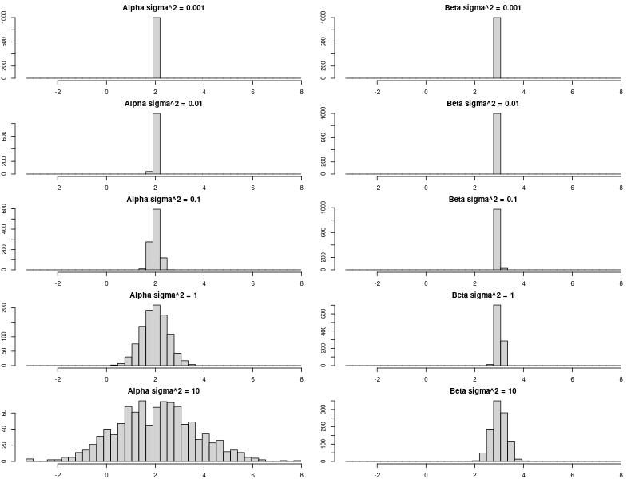

---
tags:
  - problem
  - college
  - linear_statistical_models
---
# Problem
We study the effect of $\epsilon$ on the regression estimates. We consider the simple linear regression setup. We begin by fixing the values of $\alpha$ and $\beta$. We also generate $100$ observations from $\mathcal{N}(5,1)$ and designate them as $x_{1},\dots,x_{100}$.

## Part a

Fix $\sigma^2 =1$. Construct $y$ using $y_{i} = \alpha+\beta x_{i} + \epsilon_{i}$ for $i = 1,\dots,100$, where $\epsilon_{i} \overset{\text{iid}}{\sim} \mathcal{N}(0, \sigma^2)$.
# Solution
## Part a and Part b

```r
#| label: e629fa65
x <- rnorm(n = 100,mean = 5, sd = 1)
generate_data <- function(sigma_square){
	y = 2 + 3 * x + rnorm(n = 100, mean = 0, sd = sqrt(sigma_square))
	model <- lm(y ~ x)
	return(coef(model))
}
```

## Part c

```r
#| label: 670671cd
results_0.001 <- replicate(1000, generate_data(0.001))
results_0.01 <- replicate(1000, generate_data(0.01))
results_0.1 <- replicate(1000, generate_data(0.1))
results_1 <- replicate(1000, generate_data(1))
results_10 <- replicate(1000, generate_data(10))

all_alphas <- c(results_0.001[1,], results_0.01[1,], results_0.1[1,], results_1[1,], results_10[1,])
all_betas <- c(results_0.001[2,], results_0.01[2,], results_0.1[2,], results_1[2,], results_10[2,])

b_alpha <- seq(min(all_alphas), max(all_alphas), length.out = 40)
b_beta <- seq(min(all_betas), max(all_betas), length.out = 40)

par(mfcol = c(5, 2), mar = c(2, 2, 2, 1))

hist(results_0.001[1,], breaks = b_alpha, main = "Alpha sigma^2 = 0.001")
hist(results_0.01[1,], breaks = b_alpha, main = "Alpha sigma^2 = 0.01")
hist(results_0.1[1,], breaks = b_alpha, main = "Alpha sigma^2 = 0.1")
hist(results_1[1,], breaks = b_alpha, main = "Alpha sigma^2 = 1")
hist(results_10[1,], breaks = b_alpha, main = "Alpha sigma^2 = 10")

hist(results_0.001[2,], breaks = b_alpha, main = "Beta sigma^2 = 0.001")
hist(results_0.01[2,], breaks = b_alpha, main = "Beta sigma^2 = 0.01")
hist(results_0.1[2,], breaks = b_alpha, main = "Beta sigma^2 = 0.1")
hist(results_1[2,], breaks = b_alpha, main = "Beta sigma^2 = 1")
hist(results_10[2,], breaks = b_alpha, main = "Beta sigma^2 = 10")
```
> [!OUTPUT]+ {#output-670671cd}
> 
> 

